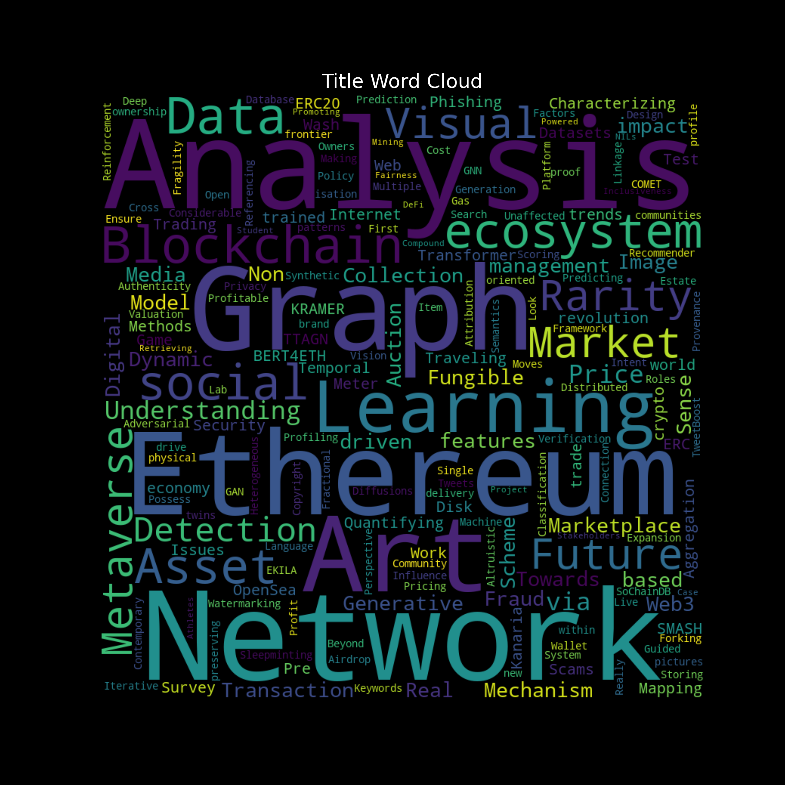
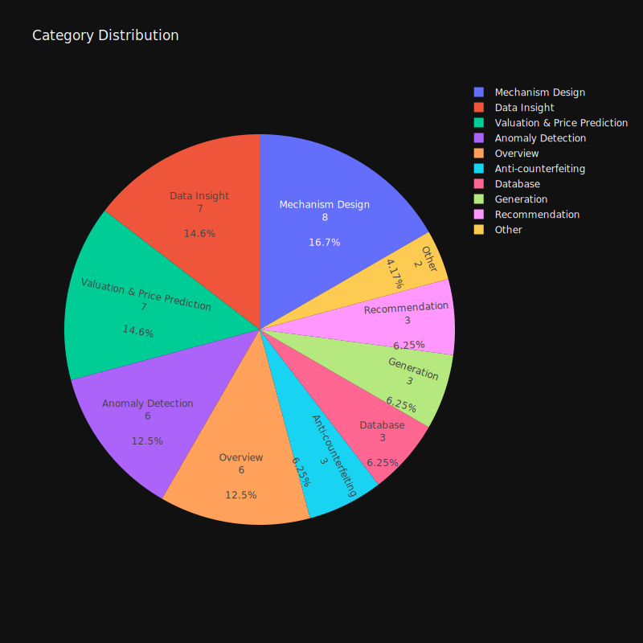
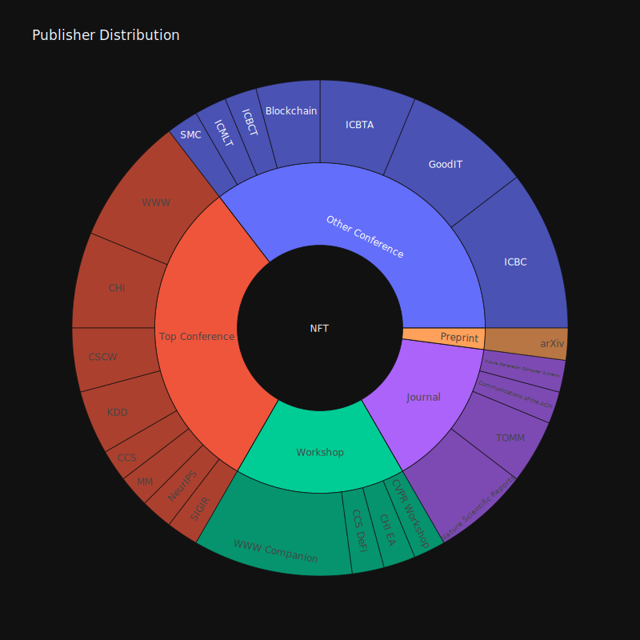

# Awesome Data-driven NFT Papers

We collect papers related to data-driven analysis and application for non-fungible token (NFT) from top conferences, journals, and specialized domain-specific conferences. We then categorize them according to their specific tasks for better organization.

**Related Top Conferences and Journals**

- NeurIPS, KDD, WWW, SIGIR, ...
- CHI, CSCW, CCS, ...
- CVPR, MM, TOMM, ...
- Nature Scientific Reports, ...

**Domain-specific Conferences**

- ICBC - [IEEE International Conference on Blockchain and Cryptocurrency](https://ieeexplore.ieee.org/xpl/conhome/10174862/proceeding)
- Blockchain - [IEEE International Conference on Blockchain](https://ieeexplore.ieee.org/xpl/conhome/1834584/all-proceedings)
- ICBTA - [ACM International Conference on Blockchain Technology and Application](https://dl.acm.org/conference/icbta)
- GoodIT - [ACM Conference on Information Technology for Social Good](https://dl.acm.org/conference/goodit)

  
  

  
  

## [Content](#content)

<table>
<tr><td colspan="2"><a href="#survey-papers">1. Overview</a></td></tr>
<tr><td colspan="2"><a href="#tasks">2. Tasks</a></td></tr> <tr>
	<td>&emsp;<a href=#data-insight>2.1 Data Insight</a></td>
	<td>&emsp;<a href=#valuation--price-prediction>2.2 Valuation & Price Prediction</a></td>
</tr>
<tr>
	<td>&emsp;<a href=#anomaly-detection>2.3 Anomaly Detection</a></td>
	<td>&emsp;<a href=#anti-counterfeiting>2.4 Anti-counterfeiting</a></td>
</tr>
<tr>
	<td>&emsp;<a href=#recommendation>2.5 Recommendation</a></td>
	<td>&emsp;<a href=#generation>2.6 Generation</a></td>
</tr>
<tr>
	<td>&emsp;<a href=#mechanism-design>2.7 Mechanism Design</a></td>
	<td>&emsp;<a href=#database>2.8 Database</a></td>
</tr>
<tr>
	<td>&emsp;<a href=#other>2.9 Other</a></td>
<td>&ensp;</td>
</tr>
</table>

### [Overview](#content)

1. **Mapping the NFT revolution: market trends, trade networks, and visual features**

    *Nadini, Matthieu and Alessandretti, Laura and Di Giacinto, Flavio and Martino, Mauro and Aiello, Luca Maria and Baronchelli, Andrea*

    Nature Scientific Reports, 2021. [`journal`](https://www.nature.com/articles/s41598-021-00053-8)

2. **Non-fungible tokens and the future of art**

    *Kugler, Logan*

    Communications of the ACM, 2021. [`journal`](https://dl.acm.org/doi/10.1145/3474355)

3. **Characterizing the OpenSea NFT Marketplace**

    *White, Bryan and Mahanti, Aniket and Passi, Kalpdrum*

    WWW Companion, 2022. [`workshop`](https://dl.acm.org/doi/10.1145/3487553.3524629)

4. **Web 3.0: The Future of Internet**

    *Gan, Wensheng and Ye, Zhenqiang and Wan, Shicheng and Yu, Philip S.*

    WWW Companion, 2023. [`workshop`](https://dl.acm.org/doi/abs/10.1145/3543873.3587583)

5. **Machine Learning for Blockchain Data Analysis: Progress and Opportunities**

    *Poupak Azad, Cuneyt Gurcan Akcora, Arijit Khan*

    arXiv, 2024. [`preprint`](https://arxiv.org/pdf/2404.18251)

6. **Characterizing the Solana NFT Ecosystem**

    *Dechao Kong, Xiaoqi Li, Wenkai Li*

    WWW Companion, 2024. [`workshop`](https://arxiv.org/abs/2403.10879)

## [Tasks](#content)

### [Data Insight](#content)

1. **Traveling the token world: A graph analysis of Ethereum ERC20 token ecosystem**

    *Chen, Weili and Zhang, Tuo and Chen, Zhiguang and Zheng, Zibin and Lu, Yutong*

    WWW, 2020. [`conference`](https://dl.acm.org/doi/abs/10.1145/3366423.3380215)

2. **Networks of Ethereum Non-Fungible Tokens: A graph-based analysis of the ERC-721 ecosystem**

    *Casale-Brunet, S. and Ribeca, P. and Doyle, P. and Mattavelli, M.*

    Blockchain, 2021. [`conference`](https://ieeexplore.ieee.org/document/9680594)

3. **Quantifying NFT-driven networks in crypto art**

    *Vasan, Kishore and Janosov, Milán and Barabási, Albert-László*

    Nature Scientific Reports, 2022. [`journal`](https://www.nature.com/articles/s41598-022-05146-6)

4. **Graph Analysis of the Ethereum Blockchain Data: A Survey of Datasets, Methods, and Future Work**

    *Khan, Arijit*

    Blockchain, 2022. [`conference`](https://ieeexplore.ieee.org/document/9881605)

5. **The social impact of NFTs in the metaverse economy**

    *Guidi, Barbara and Michienzi, Andrea*

    GoodIT, 2023. [`conference`](https://dl.acm.org/doi/10.1145/3582515.3609564)

6. **NFT SMASH: Game to Test Your NFT Rarity Sense**

    *Krasnoselskii, Mikhail and Madhwal, Yash and Stepin, Alexander and Yanovich, Yury*

    ICBC, 2023. [`conference`](https://ieeexplore.ieee.org/document/10174898)

7. **KRAMER: Kanaria NFT Collection Rarity Meter**

    *Krasnoselskii, Mikhail and Madhwal, Yash and Yanovich, Yury*

    ICBC, 2023. [`conference`](https://ieeexplore.ieee.org/document/9805542)

### [Valuation & Price Prediction](#content)

1. **TweetBoost: Influence of Social Media on NFT Valuation**

    *Kapoor, Arnav and Guhathakurta, Dipanwita and Mathur, Mehul and Yadav, Rupanshu and Gupta, Manish and Kumaraguru, Ponnurangam*

    WWW Companion, 2022. [`workshop`](https://dl.acm.org/doi/abs/10.1145/3487553.3524642)

2. **Heterogeneous rarity patterns drive price dynamics in NFT collections**

    *Mekacher, Amin and Bracci, Alberto and Nadini, Matthieu and Martino, Mauro and Alessandretti, Laura and Aiello, Luca Maria and Baronchelli, Andrea*

    Nature Scientific Reports, 2022. [`journal`](https://www.nature.com/articles/s41598-022-17922-5)

3. **The impact of NFT profile pictures within social network communities**

    *Casale-Brunet, Simone and Zichichi, Mirko and Hutchinson, Lee and Mattavelli, Marco and Ferretti, Stefano*

    GoodIT, 2022. [`conference`](https://dl.acm.org/doi/10.1145/3524458.3547230)

4. **Analysis of Non-Fungible Token Pricing Factors with Machine Learning**

    *Ho, Kin-Hon and Hou, Yun and Chan, Tse-Tin and Pan, Haoyuan*

    SMC, 2022. [`conference`](https://ieeexplore.ieee.org/document/9945566)

5. **Understanding NFT Price Moves through Tweets Keywords Analysis**

    *Luo, Junliang and Jia, Yongzheng and Liu, Xue*

    GoodIT, 2023. [`conference`](https://dl.acm.org/doi/abs/10.1145/3582515.3609562)

6. **NFT Scoring: An Analysis of the Considerable Features**

    *Nourmohammadi, Reza and Arabian, Mahdi and Ghorbanpour, Masoumeh and Nazemi, Mohammad M. and Nezhadsistani, Nasim*

    ICBTA, 2023. [`conference`](https://dl.acm.org/doi/10.1145/3581971.3581979)

7. **COMET: NFT Price Prediction with Wallet Profiling**

    *Tianfu Wang, Liwei Deng, Chao Wang, Jianxun Lian, Yue Yan, Nicholas Jing Yuan, Qi Zhang, Hui Xiong*

    KDD, 2024. [`conference`](https://arxiv.org/abs/2405.10640)

### [Anomaly Detection](#content)

1. **TTAGN: Temporal Transaction Aggregation Graph Network for Ethereum Phishing Scams Detection**

    *Li, Sijia and Gou, Gaopeng and Liu, Chang and Hou, Chengshang and Li, Zhenzhen and Xiong, Gang*

    WWW, 2022. [`conference`](https://dl.acm.org/doi/10.1145/3485447.3512226)

2. **Understanding Security Issues in the NFT Ecosystem**

    *Das, Dipanjan and Bose, Priyanka and Ruaro, Nicola and Kruegel, Christopher and Vigna, Giovanni*

    CCS, 2022. [`conference`](https://dl.acm.org/doi/abs/10.1145/3548606.3559342)

3. **Sleepminting, the brand new frontier of Non Fungible Tokens fraud**

    *Guidi, Barbara and Michienzi, Andrea*

    GoodIT, 2022. [`conference`](https://dl.acm.org/doi/abs/10.1145/3524458.3547239)

4. **NFTDisk: Visual Detection of Wash Trading in NFT Markets**

    *Wen, Xiaolin and Wang, Yong and Yue, Xuanwu and Zhu, Feida and Zhu, Min*

    CHI, 2023. [`conference`](https://dl.acm.org/doi/abs/10.1145/3580305.3599876)

5. **BERT4ETH: A Pre-trained Transformer for Ethereum Fraud Detection**

    *Hu, Sihao and Zhang, Zhen and Luo, Bingqiao and Lu, Shengliang and He, Bingsheng and Liu, Ling*

    WWW, 2023. [`conference`](https://dl.acm.org/doi/10.1145/3543507.3583345), [`code`](https://github.com/git-disl/BERT4ETH)

6. **Unveiling Wash Trading in Popular NFT Markets**

    *Yuanzheng Niu, Xiaoqi Li, Hongli Peng, Wenkai Li*

    WWW Companion, 2024. [`workshop`](https://arxiv.org/abs/2403.10361)

### [Anti-counterfeiting](#content)

1. **A Distributed Authenticity Verification Scheme Using Deep Learning for NFT Market**

    *Kimura, Keigo and Imamura, Mitsuyoshi and Omote, Kazumasa*

    ICBTA, 2022. [`conference`](https://dl.acm.org/doi/10.1145/3581971.3581977)

2. **NFT-Based Data Marketplace with Digital Watermarking**

    *Ranjbar Alvar, Saeed and Akbari, Mohammad and Yue, David (Ming Xuan) and Zhang, Yong*

    KDD, 2023. [`conference`](https://dl.acm.org/doi/abs/10.1145/3580305.3599876)

3. **Cross-Referencing Scheme to Ensure NFT and Platform Linkage Unaffected by Forking**

    *Kimura, Keigo and Imamura, Mitsuyoshi and Omote, Kazumasa*

    ICBC, 2023. [`conference`](https://ieeexplore.ieee.org/document/10174994)

### [Recommendation](#content)

1. **Predicting NFT Classification with GNN: A Recommender System for Web3 Assets**

    *Yu, Guangsheng and Wang, Qin and Altaf, Tanzeela and Wang, Xu and Xu, Xiwei and Chen, Shiping*

    ICBC, 2023. [`conference`](https://ieeexplore.ieee.org/document/10174882)

2. **The Contemporary Art of Image Search: Iterative User Intent Expansion via Vision-Language Model**

    *Yilin Ye, Qian Zhu, Shishi Xiao, Kang Zhang, Wei Zeng*

    CSCW, 2024. [`conference`](https://arxiv.org/abs/2312.01656)

3. **The Contemporary Art of Image Search: Iterative User Intent Expansion via Vision-Language Model**

    *Yilin Ye, Qian Zhu, Shishi Xiao, Kang Zhang, Wei Zeng*

    CSCW, 2024. [`conference`](https://arxiv.org/abs/2312.01656)

### [Generation](#content)

1. **NFTGAN: Non-Fungible Token Art Generation Using Generative Adversarial Networks**

    *Shahriar, Sakib and Hayawi, Kadhim*

    ICMLT, 2022. [`conference`](https://dl.acm.org/doi/10.1145/3529399.3529439)

2. **Learning Profitable NFT Image Diffusions via Multiple Visual-Policy Guided Reinforcement Learning**

    *He, Huiguo and Wang, Tianfu and Yang, Huan and Fu, Jianlong and Yuan, Nicholas Jing and Yin, Jian and Chao, Hongyang and Zhang, Qi*

    MM, 2023. [`conference`](https://arxiv.org/abs/2306.11731)

3. **EKILA: Synthetic Media Provenance and Attribution for Generative Art**

    *Balan, Kar and Agarwal, Shruti and Jenni, Simon and Parsons, Andy and Gilbert, Andrew and Collomosse, John*

    CVPR Workshop, 2023. [`workshop`](https://ieeexplore.ieee.org/document/10208679)

### [Mechanism Design](#content)

1. **A Framework for Single-Item NFT Auction Mechanism Design**

    *Milionis, Jason and Hirsch, Dean and Arditi, Andy and Garimidi, Pranav*

    CCS DeFi, 2022. [`workshop`](https://dl.acm.org/doi/abs/10.1145/3560832.3563436)

2. **Real Estate Tokenisation via Non Fungible Tokens**

    *Serrano, Will*

    ICBCT, 2022. [`conference`](https://dl.acm.org/doi/10.1145/3532640.3532651)

3. **Altruistic and Profit-oriented: Making Sense of Roles in Web3 Community from Airdrop Perspective**

    *Fan, Sizheng and Min, Tian and Wu, Xiao and Cai, Wei*

    CHI, 2023. [`conference`](https://dl.acm.org/doi/10.1145/3544548.3581173)

4. **Using NFTs for ownership management of digital twins and for proof of delivery of their physical assets**

    *Haya R. Hasan and Mohammad Madine and Ibrar Yaqoob and Khaled Salah and Raja Jayaraman and Dragan Boscovic*

    Future Generation Computer Systems, 2023. [`journal`](https://www.sciencedirect.com/science/article/abs/pii/S0167739X23001280)

5. **A Privacy-preserving Auction Mechanism for Learning Model as an NFT in Blockchain-Driven Metaverse**

    *Zhang, Qinnan and Xiong, Zehui and Zhu, Jianming and Gao, Sheng and Yang, Wanting*

    TOMM, 2023. [`journal`](https://dl.acm.org/doi/10.1145/3599971)

6. **Do NFTs’ Owners Really Possess their Assets? A First Look at the NFT-to-Asset Connection Fragility**

    *Wang, Ziwei and Gao, Jiashi and Wei, Xuetao*

    WWW, 2023. [`conference`](https://dl.acm.org/doi/abs/10.1145/3543507.3583281)

7. **Gas Cost Analysis of Fractional NFT on the Ethereum Blockchain**

    *Choi, Wonseok and Woo, Jongsoo and Hong, James Won-Ki*

    ICBC, 2023. [`conference`](https://ieeexplore.ieee.org/document/10174920)

8. **Semantics and Non-Fungible Tokens for Copyright Management on the Metaverse and Beyond**

    *García, Roberto and Cediel, Ana and Teixidó, Mercè and Gil, Rosa*

    TOMM, 2023. [`journal`](https://dl.acm.org/doi/10.1145/3585387)

### [Database](#content)

1. **SoChainDB: A Database for Storing and Retrieving Blockchain-Powered Social Network Data**

    *Nguyen, Hoang H. and Bozhkov, Dmytro and Ahmadi, Zahra and Nguyen, Nhat-Minh and Doan, Thanh-Nam*

    SIGIR, 2022. [`conference`](https://dl.acm.org/doi/10.1145/3477495.3531735)

2. **Data Mining of Compound DeFi Project**

    *Escamilla, Jesus Ariel Leon and Yanovich, Yury*

    ICBTA, 2022. [`conference`](https://dl.acm.org/doi/10.1145/3581971.3581974)

3. **Live Graph Lab: Towards Open, Dynamic and Real Transaction Graphs with NFT**

    *Zhen Zhang, Bingqiao Luo, Shengliang Lu, Bingsheng He*

    NeurIPS, 2023. [`conference`](https://arxiv.org/abs/2310.11709)

### [Other](#content)

1. **Stakeholders and Value in the NFT Ecosystem: Towards a Multi-disciplinary Understanding of the NFT Phenomenon**

    *Baytaş, Aydın and Cappellaro, Amos and Fernaeus, Ylva*

    CHI EA, 2022. [`workshop`](https://dl.acm.org/doi/10.1145/3491101.3519694)

2. **Promoting Inclusiveness and Fairness through NFTs: The Case of Student-Athletes and NILs**

    *Carvalho, Arthur and Zavolokina, Liudmila and Bhunia, Suman and Chaudhary, Monu and Yoganathan, Nitharsan*

    CHI, 2023. [`conference`](https://dl.acm.org/doi/10.1145/3544548.3580732)

